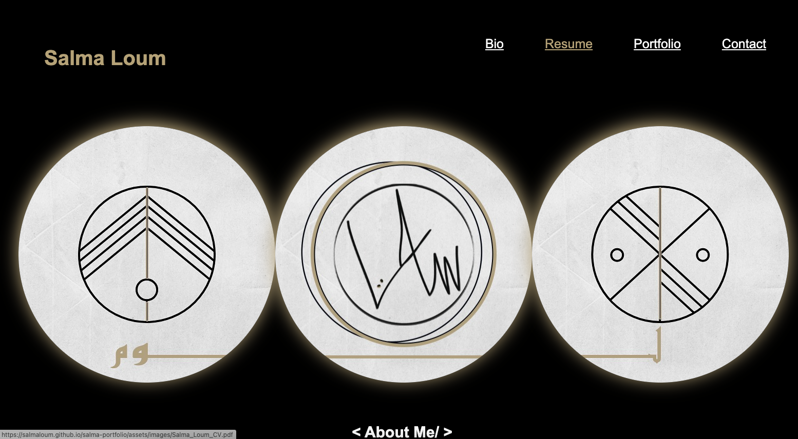
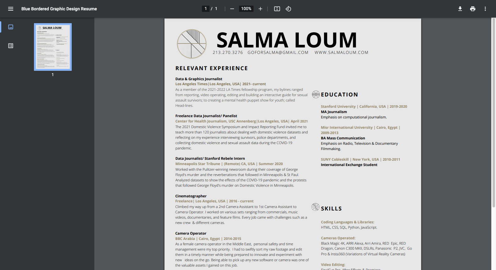

# salma-portfolio

> Salma Loum's Portfolio

## Description

In a crowded job-hunting marketplace —this is my attempt to make my portfolio fit the developer mold. Check my portfolio out!

## Table of Contents
- [Installation](#installation)
- [Usage](#usage)
- [Credits](#credits)
- [License](#license)

## Installation

Go to [webpage](https://salmaloum.github.io/salma-portfolio/) and scroll through Salma's portfolio.

## Usage

Click on the navigation links or scroll through the page to learn more about me!
To download my resume click on the "Resume" link and download the PDF, as shown below:

## Credits

- [Salma Loum](https://github.com/SalmaLoum)
- [Los Angeles Times Data Team](https://twitter.com/datagraphics)
- [UCLA Extension Bootcamp](https://www.uclaextension.edu/?gclid=Cj0KCQiAgribBhDkARIsAASA5btdbwAz8x25r3b1deoRNIGxfkPFL11rAQMuCgQ7HYiqBH8CLr9CgLoaAktlEALw_wcB&gclsrc=aw.ds)

## License

Please refer to the LICENSE in the repo.

---
